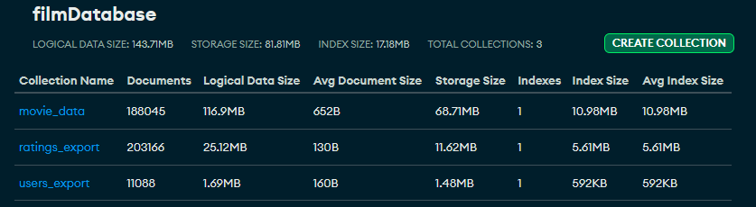
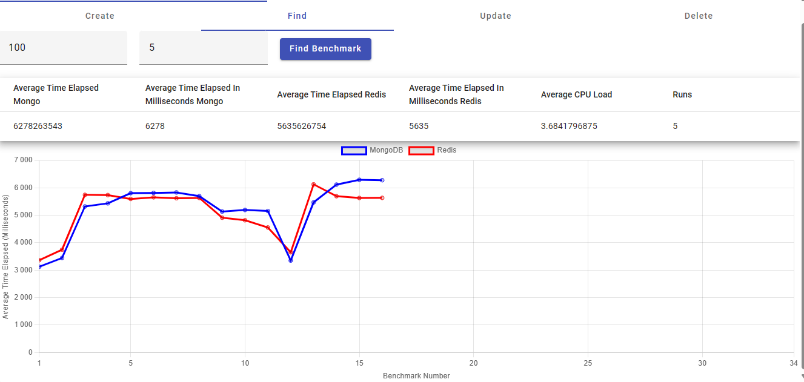

# Projet Big Data sur les films

# Membres du projet :
1) Tuan Linh Dao/ Mokhtar Samy (@mokhtar-samy et @linhkobe)
2) HASSAD Zakaria
3) Jérémie Brezzo
4) TRINH Thi Thanh Thuy (@mythy203)
5) Zaher Hicham

# Base de données
- La taille de chaque entité
  En termes de SGBD, nous avons utilisé MongoDB et Redis.
- Les données sont récupérées sur le site Kaggle, pour les consulter et leur contextes, découvrez le [lien](https://www.kaggle.com/datasets/samlearner/letterboxd-movie-ratings-data?select=ratings_export.csv).
- Dans MongoDB nous avons créé une base de données avec trois collections avec leur tailles:

# Environnement du développement :

## Logiciels :
- Java 17
- Spring Boot 3.2.4
- Docker
- RedisInsight

## Dépendances :
+ Spring Web
+ Spring Data JPA
+ H2 Database
+ Lombok

# Peuplement des bases de données locales

Lors du démarrage de l'application, les bases de données locales MongoDB et Redis sont automatiquement peuplées avec des données provenant de MongoDB Atlas. Ce processus est géré par les méthodes `initLocalMongoWithAtlasData` et `initRedisWithMongoData` dans les classes `MovieServiceMongoImpl`, `RatingServiceMongoImpl` et `UserServiceMongoImpl`.

Ces méthodes récupèrent les 1000 premiers enregistrements de chaque collection (Movie, Rating, User) depuis MongoDB Atlas, puis les sauvegardent dans les bases de données locales. Le nombre d'enregistrements récupérés peut être ajusté en modifiant la valeur de la limite dans l'objet `Query` utilisé pour récupérer les données.

Notez que ce processus est effectué à chaque démarrage de l'application.

# Comment lancer/expérimenter le projet
Pour lancer le projet, vous pouvez suivre les étapes suivants :
1) Clonez le projet par la commande "git clone https://github.com/M1-MIAGE-23-24/projet-de-d-veloppement-big-data-dao_trinh_brezzo_hassad_zaher.git"
2) Accéder au répertoire nommé "projet-de-d-veloppement-big-data-dao_trinh_brezzo_hassad_zaher"
3) Concernant le frontend et le serveur/backend
- Pour lancer le serveur/backend, mettez dans la racine du projet et lancez la commande "docker build -t app-bigdata ." et puis "docker-compose up".
- En termes du frontend, mettez dans "projet-de-d-veloppement-big-data-dao_trinh_brezzo_hassad_zaher/frontend/crud-app" et lancez la commande "npm install " et puis "ng serve -o".
4) Maintenant vous pouvez voir l'interface de l'application, il y a un sidnav avec deux options "CRUD mongodb", "CRUD Redis" et "Benchmark" :
- Dans l'option "CRUD", vous pouvez faire l'opération CRUD avec toutes les trois entités avec deux SGBD, par exemple avec entité "Movie" :
  
    + "Create" - ajouter un nouveau film à la base de données.
    + "Read" - consulter/trouver un film par "id" du film.
    + "Update" - mettre à jour un film.
    + "Delete" - supprimer un film.
- Dans l'option "Benchmark", ici vous pouvez expérimenter la comparaison en termes de performance entre deux SGBD MongoDB et Redis
  

# Benchmark
Pour le benchmark, nous avons utilisé JMH (Java Microbenchmark Harness) pour comparer les performances de MongoDB et Redis. Les tests de performances sont effectués sur les opérations CRUD pour les entités Movie, Rating et User.
Les opérations CRUD sont éxécutées en nombre de fois souhaités par l'utilisateur de l'application. 
Le but est de calculer la moyenne du temps d'exécution, CPU utilisé de chaque opération CRUD pour chaque entité et pour chaque SGBD et faire la comparaison.
- Create: Créer un nouvel ou plusieurs enregistrement(s) dans la base de données.
- Read: pour cette méthode, nous avons faire une méthode pour trouver "n" premiers enregistrements de chaque entité. 
- Update: Mettre à jour un ou plusieurs enregistrement(s) aléatoirement dans la base de données.
- Delete: Supprimer un ou plusieurs enregistrement(s) aléatoirement dans la base de données.

## Exemple de benchmark sur la méthode "Find" pour l'entité "Movie" :

1) Axes du Graphique:
- L'axe horizontal représente le numéro du benchmark.
- L'axe vertical représente le temps moyen écoulé en millisecondes pour effectuer l'opération de recherche.
Légende:
  +La courbe bleue représente les performances de MongoDB.
  +La courbe rouge représente les performances de Redis.

2) Statistiques Moyennes Affichées:

- Average Time Elapsed Mongo : Le temps moyen écoulé pour MongoDB est de 6278263543 nanosecondes, soit 6278 millisecondes.
- Average Time Elapsed In Milliseconds Mongo : Ce qui confirme que la moyenne de 6278 millisecondes est correcte.
- Average Time Elapsed Redis : Le temps moyen écoulé pour Redis est de 5635626754 nanosecondes, soit 5635 millisecondes.
- Average Time Elapsed In Milliseconds Redis : Ce qui confirme que la moyenne de 5635 millisecondes est correcte.
- Average CPU Load : La charge moyenne du CPU pendant ces tests est de 3.6841.
- Runs : Le nombre de fois que le benchmark a été exécuté est 5.

3) Interprétation du Graphique:
- Performance de MongoDB: La courbe bleue montre que MongoDB a un temps de réponse variable, avec des pics aux benchmarks 5 et 15 où le temps de réponse atteint environ 6000 millisecondes.
La courbe montre également une amélioration significative après le benchmark 15 avec une baisse des temps de réponse.
- Performance de Redis: La courbe rouge montre que Redis a des performances plus stables avec moins de fluctuations importantes par rapport à MongoDB. 
Redis reste généralement plus rapide que MongoDB avec des temps de réponse inférieurs, notamment après le benchmark 15.
- Comparaison: Redis est généralement plus performant que MongoDB, avec des temps de réponse plus courts et plus constants. MongoDB montre des temps de réponse plus élevés et une plus grande variabilité, 
ce qui pourrait indiquer des inefficacités dans certaines conditions ou des goulots d'étranglement spécifiques.