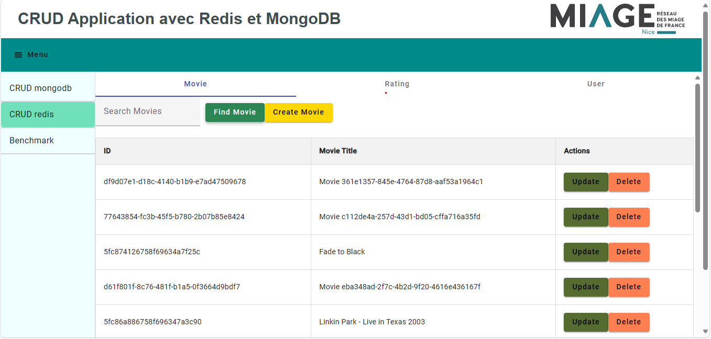
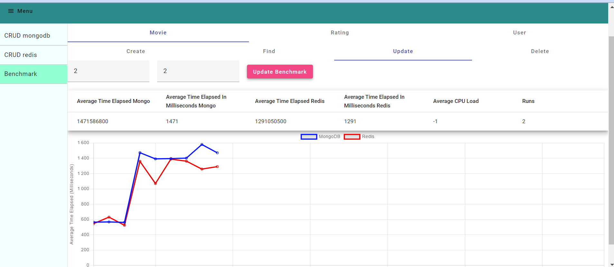

# Projet Big Data sur les films

# Membres du projet :
1) Tuan Linh Dao/ Mokhtar Samy (@mokhtar-samy et @linhkobe)
2) HASSAD Zakaria
3) Jérémie Brezzo
4) TRINH Thi Thanh Thuy (@mythy203)
5) Zaher Hicham

# Base de données
- La taille de chaque entité
  En termes de SGBD, nous avons utilisé MongoDB et Redis.
- Les données sont récupérées sur le site Kaggle, pour les consulter et leur contextes, découvrez le [lien](https://www.kaggle.com/datasets/samlearner/letterboxd-movie-ratings-data?select=ratings_export.csv).
- Dans MongoDB nous avons créé une base de données avec trois collections avec leur tailles:

# Environnement du développement :

## Logiciels :
- Java 17
- Spring Boot 3.2.4
- Docker
- RedisInsight

## Dépendances :
+ Spring Web
+ Spring Data JPA
+ H2 Database
+ Lombok

# Comment lancer/expérimenter le projet
Pour lancer le projet, vous pouvez suivre les étapes suivants :
1) Clonez le projet par la commande "git clone https://github.com/M1-MIAGE-23-24/projet-de-d-veloppement-big-data-dao_trinh_brezzo_hassad_zaher.git"
2) Accéder au répertoire nommé "projet-de-d-veloppement-big-data-dao_trinh_brezzo_hassad_zaher"
3) Concernant le frontend et le serveur/backend
- Deux façons pour lancer le serveur/backend:
    + Mettez dans la racine du projet et lancez la commande "docker build -t app-bigdata ." et puis "docker-compose up".
    + Mettez dans la racine du projet et lancez la commande "./gradlew bootRun".
- En termes du frontend, mettez dans "projet-de-d-veloppement-big-data-dao_trinh_brezzo_hassad_zaher/frontend/crud-app" et lancez la commande "npm install " et puis "ng serve -o".
4) Maintenant vous pouvez voir l'interface de l'application, il y a un sidnav avec deux options "CRUD mongodb", "CRUD Redis" et "Benchmark" :
- Dans l'option "CRUD", vous pouvez faire l'opération CRUD avec toutes les trois entités avec deux SGBD, par exemple avec entité "Movie" :
  
    + "Create" - ajouter un nouveau film à la base de données.
    + "Read" - consulter/trouver un film par "id" du film.
    + "Update" - mettre à jour un film.
    + "Delete" - supprimer un film.
- Dans l'option "Benchmark", ici vous pouvez expérimenter la comparaison en termes de performance entre deux SGBD MongoDB et Redis
  
